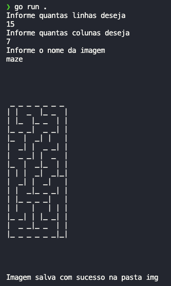
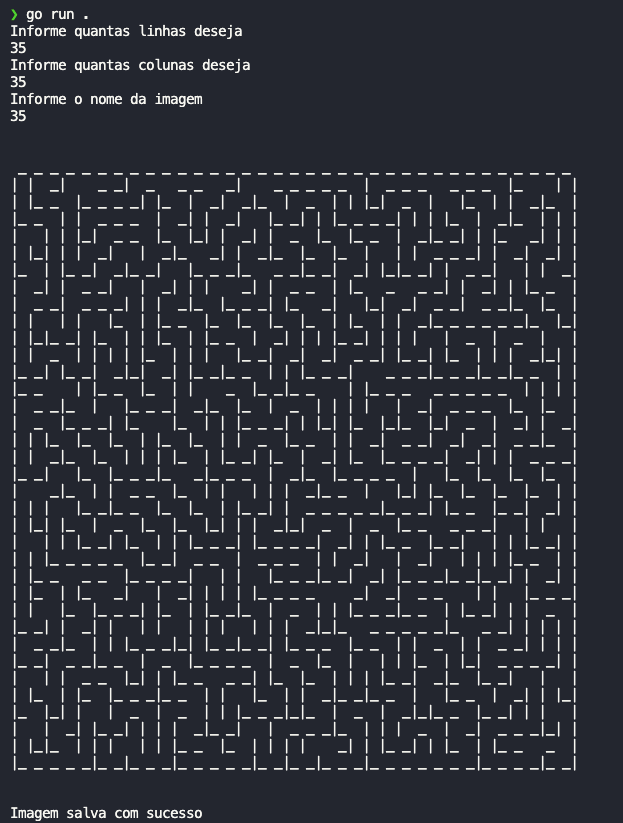
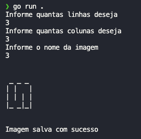

 
# Gerador de labirintos (CLI)

**Número da Lista**: 30 <br>
**Conteúdo da Disciplina**: Grafos1 <br>

## Alunos

|Matrícula | Aluno |
| -- | -- |
| 20/2028211  |  Antônio Aldísio de Sousa Alves Ferreira Filho |
| 19/0048221  |  Rodrigo Balbino Azevedo de Brito |

## Sobre

O projeto é um gerador de labirinto pseudo-aleatório via terminal que gera uma imagem em PNG. Sendo possível escolher o tamanho em linhas e colunas do labirinto e o nome da imagem. O objetivo é criar um labirinto a partir de grafos usando [depth first search (DFS) - busca pela profundidade -](https://en.wikipedia.org/wiki/Depth-first_search) utilizando a [linguagem golang](https://go.dev/).

## Screenshots








## Instalação

**Linguagem**: GoLang - 1.20 <br>


## Uso

```bash
cd cmd && go run main.go
```
